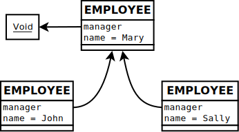
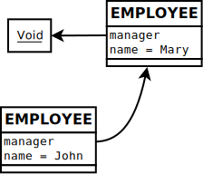
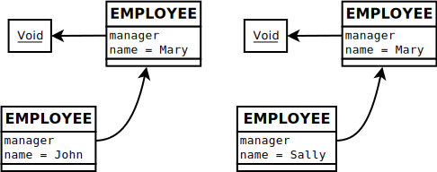

---
---

# Single representation discussion

Consider an HR (human resources) system with a conceptual class *EMPLOYEE*.
Each *EMPLOYEE* has a *name* attribute and a *manager* attribute.

Consider a universe with three *EMPLOYEE*'s: Mary, John, and Sally. Mary is
John's manager. Mary is also Sally's manager. Mary is the ower of the company,
so she has no manager.

The conceptual objects in the universe have this structure:

## Importing a subset of the universe

Consider an execution with its own active address space. The execution
recursively imports the *EMPLOYEE* John from another address space (perhaps
from a central database). The runtime objects in the execution's address space
have this structure:

The runtime objects in the execution's address space are a faithful
representation of a subset the conceptual objects in the universe.

## Typical single representation breakdown

Some time later, the same execution recursively imports the *EMPLOYEE* Sally.
In some translator implementations the second import results in this runtime
object structure:

The runtime objects in the execution's address space are no longer a faithful
representation of the conceptual objects in the universe. For instance, the
runtime object structure indicates that *EMPLOYEE* John and *EMPLOYEE* Sally do
not have the same manager, when we know that in fact they do have the same
manager. The runtime object structure also indicates that there are at least 4
*EMPLOYEE* objects in the universe, when we know that in fact there are only 3
*EMPLOYEE* objects in the universe.

Furthermore, consider what happens if we altered the attributes of one of our
runtime employees named Mary, without altering the other: what is the meaning
of our runtime object structure now?

A full semantic breakdown ensues, all due to the fact that our address space
has multiple representations of the same conceptual object.

